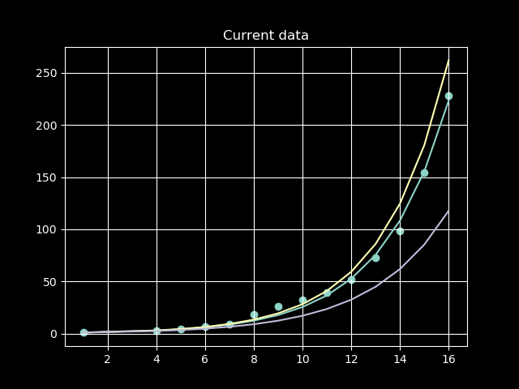
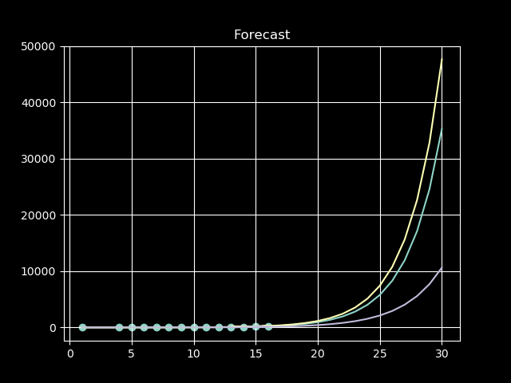

# COVID Tennessee Case Count Forecast

Date: 2020.3.20

## Data

Data was collected from https://www.wate.com/health/coronavirus/coronavirus-in-tennessee-covid-19-cases-hit-228-according-to-state-health-department/

There are only 16ish days of data for Tennessee, and no other state's data was
used.

## Model

A very simple model using an exponential formula was fit:

$$
y = ae^(bx)
$$

This is overly simplistic, but I am operating under the assumption that the
curve will continue to look exponential for a while. I generated a prediction
range by varying $b$ by a small amount in either direction.

## Results

The model was simulated only once, with an arbitrary variance range because it's midnight and I want to go to bed but still want to document this.

Running the model with a $b$ range of $[.04, .01]$ gave the following graphs:

The current data:



The forecasted graph:



The range for predicted values for April 3rd (or day 30) are:
```
47670 (b + .01)
35315
10637 (b - .04)
```
